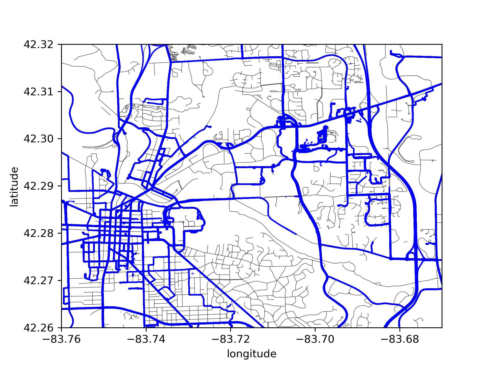
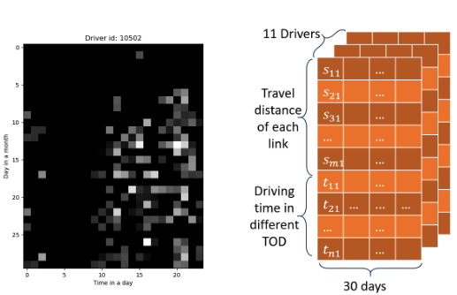
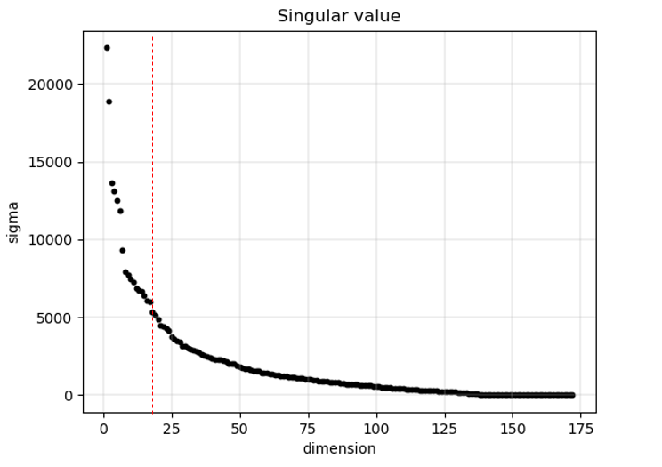
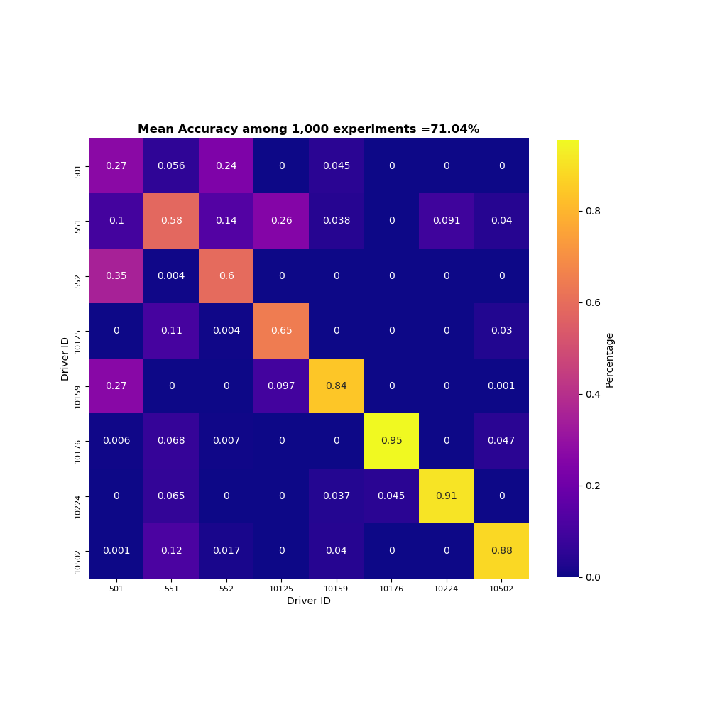
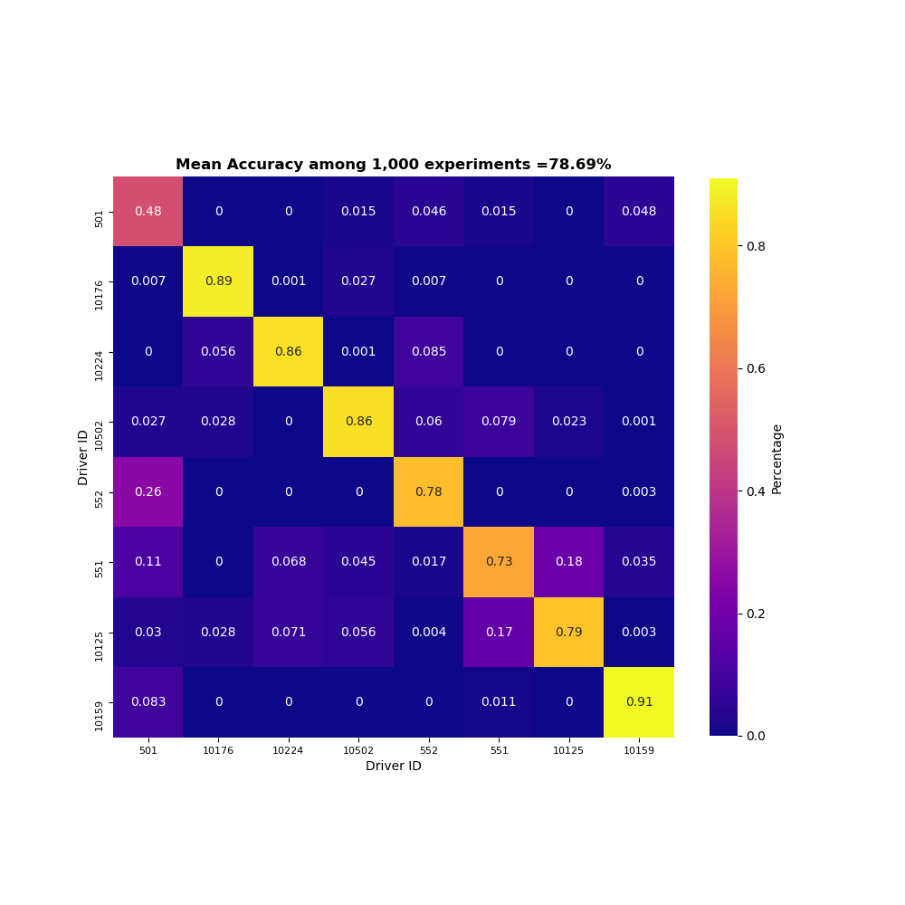

# Driver Identification based on Route and Driving Time solely using Trajectory Data

## Abstract

In current research field, there are many researches on identifying drivers using mobility data, including CAN bus data and trajectory data. Many classification models they presenting were trained with data from these data sources focusing on the drivers’ driving behavior. However, it is hard to quantify or describe the drivers’ behavior because it is highly affected by the environment including the weather and traffic condition. In this paper, we explore the possibility of constructing driver identification model using the route and driving time information which uses the trajectory data as the only input. We use dataset from Safety Pilot Model Deployment (SPMD) and matched the original trajectory to the existing road network using Hidden Markov Model (HMM). To form the training data,a reformatted matrix is created to reflect the distance traveled in each network link and the travel time in a day. Both Nearest Subspace (NS) and Random Forest (RF) are trained in the training stage. Analysis about the impact of driver number and individual driver data quality on model accuracy were performed. In conclusion, our driver identification model can achieve a satisfying performance using only trajectory data and individual driver’s predicting accuracy depends on its trajectory data quality.

# Introduction

With the rapid development of smartphones and communication technologies, floating car data (FCD) are becoming more and more easy to obtain. Compared with traditional detectors, FCD provides a more substantial amount of data at a lower cost. In recent years, FCD has been widely used for many applications, such as queue length estimation, traffic state estimation, traffic volume estimation and risk evaluation (1-6).

Each probe vehicle works as a moving sensor on the road and its trajectory records driver’s driving behavior and daily travel information. These precious data provide great convenience for researchers, but it also brings a lot of privacy concerns which are whether driver’s identification information can remain anonymous. If the driver can be re-identified based on their historical trajectory data, then the driver’s privacy will be compromised. More importantly, it will cause a widespread panic among those who are sharing their mobility data. Also, to flag counterfeit data,driver identification can help transportation researchers or organizations who rely on trajectory data to perform analysis detect outliers in their dataset.

Therefore, in recent years, many researchers focused on how to identify driver based on mobility data. Lots of researchers leverage CAN bus signals to develop identification models. That is because CAN bus signal records how drivers react to daily traffic situation which makes it a good representation of driving behavior. Wakita et al. (7) and Miyajima et al. (8) developed two types of models and made a comparison between them. The first type is based on a physical model (Helly model and optimal velocity model) and the second type is Gaussian Mixture Model (GMM). The results show that GMM has a better performance and achieve 78% accuracy among 274 drivers in the field test. Enev et al. (9) used random forest method to reach 99% accuracy with 5 sensors signals and 87% accuracy among 15 test drivers with only the brake pedal sensor and route information. Hallac et al. (10) build a classifier according to a single turn scenario in 12 most frequently situations such as rural, urban, etc. The average accuracy is 50.1% for identifying between five drivers. There are also researchers use virtual simulators in order to mimic vehicle CAN bus data. Zhang et al. (11) used Hidden Markov Model (HMM) and GMM model based on data collected from drivers in a simulation environment. Their model reaches 73% accuracy.

However, there are some deficiencies with the methods mentioned above. The most important limitation is that these data are all collected in a limited and controlled test environment. As a result, driving behavior of drivers are collected in a fixed traffic state such as traffic volume, time-of-day, weather, etc. In the real world, however, the trajectory data of different drivers may come from different traffic situations. Therefore, using real-world trajectory data may not return a satisfied classification accuracy. Another limitation is that CAN bus data are usually very hard to obtain which also restrict the implementation of those methods. What’s more, using data collected from simulation environment would also not a good idea because drivers will not react the same as in the real world in virtual simulator due to the lack of real-world traffic patterns and weather conditions, etc.

The goal of the research is to explore whether we can do driver re-identification solely based on trajectory data i.e., longitude, latitude and timestamp of vehicles. This requires only trajectory information of each driver, so the model proposed in this paper has a good generalization ability and solid use prospects.

The rest of the paper is organized as followed. Section 2 will first introduce the data we used and the data preprocessing method. Then, Section 3 will thoroughly discuss the Nearest subspace and Random Forest approach we implement for driver re-identification. Result analysis and comparison of these two methods will be discussed in Section 4. Finally, Section 5 gives the concluding remarks and future works.

# Dataset Preparation

## Data Source

The dataset used in this paper is from the Safety Pilot Model Deployment (SPMD) project lead by the University of Michigan Transportation Research Institute (UMTRI). SPMD has as many as 2, 800 vehicles equipped with devices for V2V and V2I communication system. There are four types of vehicle equipment configurations in SPMD vehicles: Integrated Safety Device (ISD), Aftermarket Safety Device (ASD), Retrofit Safety Device (RSD) and Vehicle Awareness Device (VAD). Among the 300 vehicles equipped with ASD, 98 are equipped with data acquisition system (DAS), which is used to record data including forward object information, position information, lane tracking information and remote vehicle BSM and classification. There are many channels in the SPMD dataset in the dataset manual. In the DataWsu File of the DAS1 dataset, both the GPS trajectories and the heading are included, which will be our main data source.

There are totally 11 drivers’ trajectory data for 30 days in the data source and each trajectory includes the latitude, longitude, timestamp and driver id with a sampled period of 0.1s. Besides the trajectory data, the map information is also required to map the trajectory data to the road network. This paper used the road network information provided by OpenStreetMap. In this road network, a road was defined as a link composed of a series of nodes with known latitude and longitude, and there are also some details of the road such as whether the road is a one way. The following figure gives a brief view of the original data source. The blue lines, which are composed of a series of trajectory points, are the trajectory data provided by the SPMD while the light grey lines are the road network. In this figure, although it seems that the trajectory points are right on the road network, they are not matched yet.

###### Figure 1:the input data source: blue lines are trajectories while the grey lines are the road network

## Map Matching

The main features to identify the driver in this paper are the route and driving time. Therefore, the trajectories should be matched to the road network so that we can know which road each trajectory belongs to. This paper utilized the Hidden Markov Model to match the trajectory data proposed by ((reference here)).

The key problem in map matching is the tradeoff between the roads suggested by the location data and the feasibility of the path. For example, one simple method to determine the link that the GPS point belongs to is to find the nearest link among all the candidate links. However, this method ignore the relation between the GPS points and the feasibility of the path. The model proposed by ((reference)) has two parts to quantify the probability that which link that one GPS point might belong to.

###### Fig 2 Hidden Markov Model to map the trajectory data

As shown in the figurae, z*t and z*{t+1} are the GPS points at time stamp t and t+1, r1, r2 and r3 are different links. The first part is related the distance between the links and the trajectory points. The GPS points are assumed as a Gaussian distribution so that the probability can be written as:
$$p(z_t|r_i)=\frac{1}{\sqrt{2\pi}\sigma_z}e^{-0.5\cdot (\frac{||z_t-x_{t,i}||}{\sigma_z})^2}$$

The other part to evaluate the probability is the feasibility of the path, the paper defined the transition probability as:

$$p(d_t)=\frac{1}{\beta}e^{-\frac{d_t}{\beta}}$$

Where the $d_t$ equals to

$$d_t=|||z_t-z_{t+1}||_{great circle} - ||x_{t, i^*}-x_{t+1,j^*}||_{route} |$$

Which means that the shorter the route, the greater the probability the route is the true route. So far the model has defined the probability of each state and also the transition probability from one state to another shown as figure \*. Then the map-matching problem can be converted to a dynamic programming problem.

Here are the results of the map-matching algorithm. The blue line is the trajectory and the grey lines are the road network. The red points show the result after matching the trajectory data to the road network and the sampled period chosen here is 3 secondes. The green points are also the candidates after projecting the trajectory points to the links but they are not selected. The figure \* shows more details about the dynamic programming, the x axis is the index of the time stamp while the y axis is the index of the candidate links. Because if the distance between the candidate links will be discarded if the distances between the links and the trajectory points exceed a threshold (about 20 m), most of the time there is only one candidate link. The number of candidate links will increase when there is a intersection and at this time the algorithm will automatically select the right link considering both the distance between the links and the trajectory points and the feasibility of the path.

###### Fig 3 Map-matching using Hidden Markov Model

Since the dataset do not have a ground truth of the map-matching, it is hard to quantify the accuracy of the map-matching algorithm. To test the map-matching algorithm, we simply plotted the map-matching results as the figure \* and manually evaluated the algorithm. It turned out to be quite accurate except for the absence of the road network.

###### Fig 4 Examples of map-matching results

## Dataset Reformat

After matching the trajectory data to the road network, we can exactly know what the distance of each driver drives on each link. This paper utilize this route information to identify different drivers since different drivers have different regular demand for daily driving. Besides the route, the driving time is also used as a feature to distinguish different drivers. Figure \* gives the driving time heatmap of a specific driver. The axis x is the time in a day (24 hours) while the axis y is index of the day in a month.

###### Fig 5 driving time heatmap for a driver

A shown in Fig\*, there are totally 11 drivers’ 30 days’ trajectories. Each day’s trajectory of each driver was considered as a sample data denoted as a column vector $x$. The column vector $x$ is composed of the distance that the driver travel on each link and the driving time (unit:h) from 00:00 to 23:59. In the latter numerical experiment, several days’ data was used as the test data while the left-over data was used as the training data.

# Methodology and Numerical Results

## Method 1, Nearest subspace classification

The nearest subspace (NS) classification algorithm is an efficient method for multi-classification problem. It has been widely used in machine learning region and shows good performance dealing with face recognition [1-2] and handwritten digit classification [3], etc. In recent years, the nearest subspace has also been proved effective for classification problems with missing or noisy input data [4-5].

The training set data can be grouped according to its class (label). Each point has $d$ dimension features and there are$N data points in class$i$. Then the training set of class$i can be represented as ­ $D*{i}\in\mathbb{R}^{d*N}$. The key idea of NS is that each class will form a subspace and an unknown vector will be classified to which subspace it is closest to.
The first step is to construct subspace of all classes. An efficient way to calculate orthogonal bases representing the subspace is based on matrix Singular Value Decomposition (SVD). For any matrix $A\in\mathbb{R}^{m*n}$ can be written as the product

$$A=U\Sigma V^{H}=\sum*{i=1}^{r}\sigma*{i}u*{i}v*{i}^{H}$$

Where $U\in\mathbb{R}^{m*m}$ and $V\in\mathbb{R}^{n*n}$ are orthogonal matrices and $u*{i}, v*{i}$ are left and right singular vectors, respectively. \Sigma is an $(m*n)$ diagonal matrix with non-negative entries, ordered in the following way:
$$\sigma*{1}\geq\sigma*{2}\geq...\geq\sigma*{r}\geq0$$

For any given vector $x, it can be projected to$\mathcal{R}(A)by
$$A \cdot x=\sum_{i=1}^{r}\sigma_{i}u_{i}v_{i}^{H}x=\sum_{i=1}^{r}(\sigma_{i})(v_{i}^{H}x)u_{i}$$

Therefore, $U=[\begin{array}{}u_{1} & u_{2} & ... & u_{r}\end{array}]$ is the projection matrix of $\mathcal{R}(A)$. However, in many applications, the input data is often high dimensional and contain noise. Therefore, using all left singular vectors to construct subspace will not return the best classification performance because it captures and reserves all the noise [5]. To resolve this problem, we need to select first$k$ left singular vectors as the orthogonal bases of the subspace. The selection of dimension$k$can based on the singular value spectrum of all the training data. The number of singular values appear to separate from the continuous portion of the spectrum would be the initial selection of$k. Then using validation, we can further modify the choice of \$k. Choosing a low-dimensional subspace instead of all left singular vectors is equivalent to feature selection. And the process of feature selection done by SVD is essentially the same as PCA method.

According to the aforementioned process, we can obtain$U^{i}\in\mathbb{R}^{d*k}$as a matrix of orthogonal basis vectors representing$k$dimension subspace of data in class$i$.
Then we can define the orthogonal projection matrix onto $\mathcal{R}(U^{i})$ as $\mathcal{P}^{i}$:
$$\mathcal{P}^{i}=U^{i}\cdot(U^{i})^{H}$$
Let $\mathcal{S}$ define the set of all classes. The predicted label for vector can be decided by the Euclidean distance to each subspace. It can be formulated as the following optimization problem:
$$label=\arg\min*{j\in\mathcal{S}}\left\Vert (I-\mathcal{P}^{i})x\right\Vert *{2}^{2}$$
Based on the mentioned process, we apply NS algorithm in our problem. The singular value spectrum of our dataset are shown as figure 6. The spectrum shows that there are approximately 15-20 singular values separate from the continuous portion. Therefore, the selection of subspace dimension should be 15-20.

###### Fig 6 singular value

However, due to the lack of data, some of the drivers just have very limited data then we can only set the dimension $k$ as close to 15 as possible. To guarantee that $k$ no less than 10, we filter out 3 drivers who have less than 10 driving data in this month. Then for the rest of 8 drivers, we set $k$ equals to 10 and randomly choose 1 data per driver to constitute the test set. After doing 1000 times experiments, the mean accuracy of classification error is 71.04%. Noted that this result is achieved by very low dimension of subspace. According to the mechanism of NS algorithm, the accuracy will increase if we have more data and can set$k$ higher. The following figure 7 shows the classification correction heatmap. The x-axis is the true label and the y-axis is the predicted label. Therefore, the entry$(i,j)$represents the percentage of test data belonging to the class$i identified as the class \$j. So the elements on the diagonal indicate the classification accuracy of each class in 1000 experiments

###### Fig 7 classification correction heatmap

From the result, we can find that last four drivers have very high classification accuracy. But for the first driver, the model is not working well. One possible reason is that last four drivers might have very clear routing and driving period pattern. Another possible reason is that the driver 501 has only 10 training data, which is too limited compared to other drivers, resulting in insufficient representation of the driver's daily mode.

## Method 2: Random forest classification

Aside from the nearest subspace classification, we also use random forest classification to solve this multiclass classification problem. Random Forest is an ensemble learning method which learns through constructing a number of decision trees and outputting the class which gets the highest probabilistic prediction from individual trees. Random forest algorithm was created by Ho (1995), and Breiman (2001) proposed an extended random forest classification by introducing “bagging” idea and random selection of features. Because the dataset we are trying to learn has high dimensionality and the decision tree is robust to the inclusion of irrelevant features, for this classification problem, we choose to use the Breiman’s random forest classification algorithm.

The random forest model use bagging, also called bootstrap aggregating, technique. Given the training set $X=X_1,X_2,\cdots,X_n$ and training label $Y=Y_1,Y_2,\cdots,Y_n$, for each tree out of total $L$ trees, bagging selects a random sample with replacement of the training set $N^{'}_{l} \leq N$ and train tree with $N^{‘}_{l}$. Using bagging allow us to acquire better model performance by decreasing the variance of the model, without increasing the bias.

In an individual decision tree, the random forest model also implements feature bagging in determining split in each node. The feature bagging, also called as Random subspace method try to reduce the correlation between trees in an ensemble by training them on random samples of features instead of the entire feature set. For each tree, given a random sample from bagging $N^{'}_{l}$ with dimension $D$, at each candidate split in the learning process, the tree will use a random subset of the features $D^{'}$ to determine the optimal splitting.The size of random set of features is $D^{'}=round(\sqrt{D})$. The optimal split in each node is chosen by minimizing Gini Impurity. Also, to further reduce variance in each decision tree and improve generalization performance, we constrain the maximum depth and minimum sample size required for each split. Together with the number of trees in the ensemble, we have used grid search cross-validation to find the best hyperparameter value.

There are three important parameters for our random forest classifier: $N_{estimators}$, $max_depth$, and $min_samples_split$. Is is unknown that which combination of these three hyperparameters is best for solving this classification problem. So, we did a grid search cross-validation to find the best combination of these three parameters. Before we started grid searching, we first divide the training set into 10 subsets of equal size and this is also called 10-fold cross-validation. Sequentially one of 10 subsets is used for testing the classifier trained by the rest of 9 subsets. And the accuracy of cross-validation is the percentage of data being correctly classified. After dividing the training set into 10 folds, then we start doing “grid-search” on different hyperparameter pairs. For $N_{estimators}$, we use a list of value range from 5 to 50; for $max_depth$, we use a list of value range from 15 to 40; and for $min_samples_split$, we use a list of value range from 2 to 11. After grid-search all possible pairs on 10-folds we divided, the best parameters set found is that $N_{estimators}=35$, $max\_depth=21$, and $min\_samples\_split=2$.

After we acquire the best hyperparameter set from grid-search cross-validation, the random forest classifier is ready to be trained. To show the overall performance of the classifier, we have train the random forest model for 1000 times and generate correction heatmap((\ref{Figure})). The mean accuracy among 1000 experiment is 78.69%. And as we can see in the correction heatmap, driver 501 has not been classified very well compared to other drivers with an average accuracy of 0.48.

###### Fig 8 classification correction heatmap

## Comparison Between Two Methods

Compared with NS algorithm, Random Forest has a higher average accuracy. For specific driver, Random Forest performs much better in the first four(501, 10176, 10224, and 10502) and especially for the first driver(501). But NS outperformed the RF algorithm in the last four drivers(552, 551, 10125, and 10159). Take a closer look at recall performance, the first two drivers(501 and 10176) have a lower true positive rate. And in the RF algorithm, drivers 6 and 7(551 and 10125) have underperformed in terms of recall performance.

# Conclusion

In this paper, we discover the need and the challenge for driver identification from literature review. This paper offered a detailed trajectory data processing and machine learning solution to solve driver identification problem. It begin only with the longitude, latitude, and timestamp of vehicle trajectory data. After being matched to the real world road network using carefully designed Hidden Markov Model, the map-matched trajectory data has higher accuracy and can reflect the actual precise travel route in each trip. Focusing on the unique pattern in terms of time in a day and route choice for each driver, we reformatted the trajectory data into the travel distance in each network link and the average driving time in a day. The data quality issue was also examined and we keep 8 out of 11 total amount of drivers which have enough trips data for training models. Then we use both Nearest Subspace Algorithm and Random Forest Algorithm to train a machine learning model. From the result of both two classification methods, the Random Forest has a higher average accuracy (79%) compared to the Nearest Subspace (71%). After realizing the number of driver may impact the overall accuracy performance of the models, we examine the influence of various drivers number to the overall accuracy. Acknowledging that some drivers are predicted with lower accuracy than others, to find out the reason behind this, we take a closer look two drivers who have different identification rates. Because our proposed driver identification framework only require trajectory data in time and route level and achieved a relatively high accuracy, we believe that this solution can be scaled in large dataset which contains thousands of drivers.

## Reference

Seo, T., and Kusakabe, T., “Probe vehicle-based traffic state estimation method with spacing information and conservation law,” Transportation Research Part C: Emerging Technologies, Vol. 59, 2015, pp. 391–403.

Zheng, J., and Liu, H. X., “Estimating traffic volumes for signalized intersections using connected vehicle data,” Transportation Research Part C: Emerging Technologies, Vol. 79, 2017, pp. 347–362.

Comert, G., and Cetin, M., “Queue length estimation from probe vehicle location and the impacts of sample size,” European Journal of Operational Research, Vol. 197, No. 1, 2009, pp. 196–202.

Hofleitner, A., Herring, R., Abbeel, P., and Bayen, A., “Learning the dynamics of arterial traffic from probe data using a dynamic Bayesian network,” IEEE Transactions on Intelligent Transportation Systems, Vol. 13, No. 4, 2012, pp. 1679–1693.

Irschik, D., and Stork, W., “Road surface classification for extended floating car data,” Vehicular Electronics and Safety (ICVES), 2014 IEEE International Conference on, IEEE, 2014, pp. 78–83.
Herrera, J. C., Work, D. B., Herring, R., Ban, X. J., Jacobson, Q., and Bayen, A. M., “Evaluation of traffic data obtained viaGPS-enabled mobile phones: The Mobile Century field experiment,” Transportation Research Part C: Emerging Technologies,Vol. 18, No. 4, 2010, pp. 568–583.
Wakita, T., Ozawa, K., Miyajima, C., Igarashi, K., Itou, K., Takeda, K., and Itakura, F., “Driver identification using drivingbehavior signals,” IEICE TRANSACTIONS on Information and Systems, Vol. 89, No. 3, 2006, pp. 1188–1194.

Miyajima, C., Nishiwaki, Y., Ozawa, K., Wakita, T., Itou, K., Takeda, K., and Itakura, F., “Driver modeling based on driving behavior and its evaluation in driver identification,” Proceedings of the IEEE, Vol. 95, No. 2, 2007, pp. 427–437.

Enev, M., Takakuwa, A., Koscher, K., and Kohno, T., “Automobile driver fingerprinting,” Proceedings on Privacy Enhancing Technologies, Vol. 2016, No. 1, 2016, pp. 34–50.

Hallac, D., Sharang, A., Stahlmann, R., Lamprecht, A., Huber, M., Roehder, M., Leskovec, J., et al., “Driver identificationusing automobile sensor data from a single turn,” Intelligent Transportation Systems (ITSC) 2016 IEEE 19th International Conference on, IEEE, 2016, pp. 953–958.

Zhang, X., Zhao, X., and Rong, J., “A study of individual characteristics of driving behavior based on hidden markov model,” Sensors & Transducers, Vol. 167, No. 3, 2014, p. 194.

Booz, H., Allen, “Safety pilot model deployment - sample data environment,” 2015.

Bezzina, D., and Sayer, J., “Safety pilot model deployment: Test conductor team report,” Report No. DOT HS, Vol. 812, 2014,p. 171.

Huang, X., Zhao, D., and Peng, H., “Empirical study of dsrc performance based on safety pilot model deployment data,”parameters, Vol. 12, 2017, p. 14.

Newson, P., and Krumm, J., “Hidden Markov map matching through noise and sparseness,” Proceedings of the 17th ACM SIGSPATIAL international conference on advances in geographic information systems, ACM, 2009, pp. 336–343.

Lee, K.-C., Ho, J., and Kriegman, D. J., “Acquiring linear subspaces for face recognition under variable lighting,” IEEE Transactions on Pattern Analysis & Machine Intelligence, , No. 5, 2005, pp. 684–698.

Naseem, I., Togneri, R., and Bennamoun, M., “Linear regression for face recognition,” IEEE transactions on pattern analysisand machine intelligence, Vol. 32, No.11, 2010, pp. 2106–2112.

Savas, B., and Eldén, L., “Handwritten digit classification using higher order singular value decomposition,” Pattern recognition,Vol. 40, No. 3, 2007, pp. 993–1003.

Asendorf, N., and Nadakuditi, R. R., “The performance of a matched subspace detector that uses subspaces estimated from finite, noisy, training data,” IEEE Transactions on Signal Processing, Vol. 61, No. 8, 2013, pp. 1972–1985.

Ho, T. K., “Random decision forests,” Document analysis and recognition, 1995., proceedings of the third internationalconference on, Vol. 1, IEEE, 1995, pp. 278–282.

Breiman, L., “Random forests,” Machine learning, Vol. 45, No. 1, 2001, pp. 5–32.
